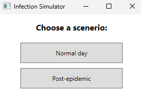
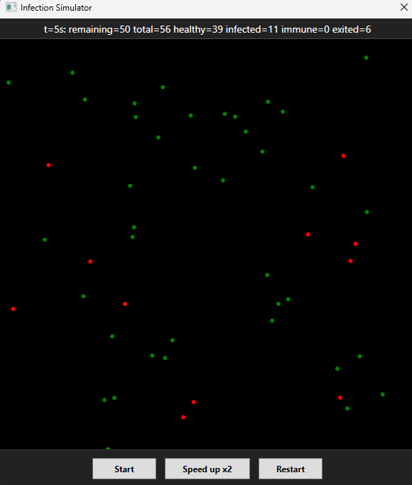
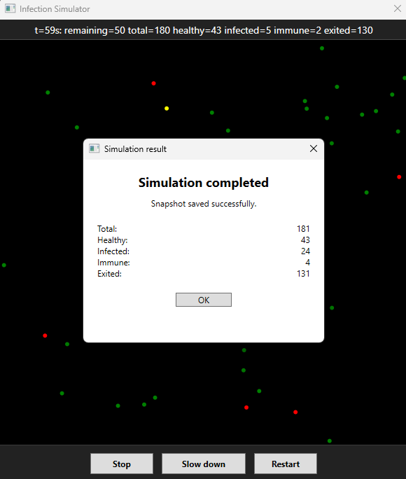

# InfectionSimulator — WPF Real-Time Infection Simulation

An application that simulates the spread of infection in a population of moving agents.

Frontend written in **WPF**, backend in **C#**, with real-time motion visualization, interactive controls, and live statistics.

---

## Features

### **Frontend (WPF)**
- Real-time agent rendering at 60 FPS.
- Accurate representation of movement, wall reflections, and collisions.
- **Statistics bar** updated every 1 second:
  - Number of healthy individuals
  - Infected individuals
  - Immune individuals
  - Individuals who left the area
  - Total number of active agents
- **Control buttons** at the bottom:
  - **Stop / Start** — pause and resume the simulation.
  - **Speed / Slow** — double or restore the simulation speed, scaling all agent interactions proportionally.
  - **Restart** — reset the simulation from the beginning.
- Stopping the simulation automatically after a set time (default: 60 seconds).

### **Backend (simulation logic)**
- Agent system with:
  - Health status (Healthy / Infected / Immune)
  - Presence status (Active / Exited)
  - Speed, direction, and collisions
- Population startup modes:
  - **Normal day**
  - **Post-epidemic world**
- Realistic infection model dependent on distance and contact time.
- Snapshot system storing the final population state in **JSON**.

### **Snapshot & Result Window**
- Each agent can create its own `PersonMemento`.
- After the simulation ends, a JSON file is saved:

```
snapshot.json
```

- A **result window** pops up showing the final statistics:
  - Total agents
  - Healthy
  - Infected
  - Immune
  - Exited
- Allows immediate restart by opening the scenario selection window again.

---

## **Technologies and Tools**
- **C# / .NET 9.0**
- **WPF**
- **DispatcherTimer** + **CompositionTarget.Rendering**
- **JSON serialization** for snapshots
- Git + GitHub (commit & CI expandable)

---

## **Starting**
1. Open the project in **Visual Studio 2022 or newer**.
2. Make sure the WPF project is set as the `Startup Project`.
3. Click **Start** — the simulation begins automatically.
4. Use the bottom control buttons to pause/resume, speed up, slow down, or restart the simulation.
5. The program runs until the set time expires or until you stop/restart manually.  
(you can also use "ready to go" app in publish folder ([see](publish)))

---

## **Statistics Performance**
- Refreshes every 1 second.
- Fully displayed in the UI (no console output required).
- Accurately reflects the real-time simulation state.

---

## **Issues resolved during implementation**
- Map scaling with additional UI panels.
- Collision offsets at the bottom and right edges.
- Animation synchronization with simulation logic.
- Start/Stop, Speed/Slow, and Restart controls integrated.
- Proper shutdown and reopening of scenario and result windows.
- Snapshot saving and result window display at simulation end.

## **Idea for future development**
- executing an infinite loop so that the simulation can run for a non-predetermined time (like now 60 seconds)
- loading snapshots and continuing the simulation with received data
- simulation speed slider - the user can smoothly modify the speed (currently one button doubles the speed)

## **Screenshots**


